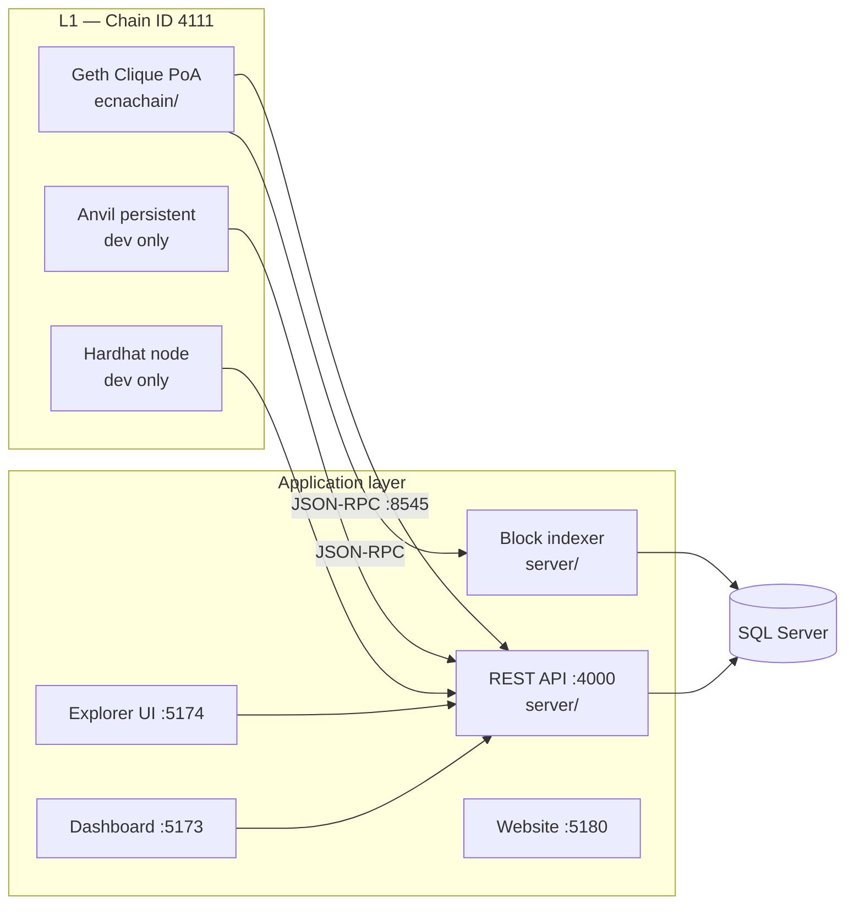

# ECNASCAN

**E Canna (ECNA) L1** + BscScan-style explorer + wallet dashboard.

| | Mainnet | Testnet |
|--|---------|---------|
| Full name | E Canna | E Canna Testnet |
| Symbol | ECNA | tECNA |
| Chain ID | **4111** | **4112** |
| Genesis supply | **1 Crore** (10,000,000) | Treasury 100M + faucet 100M tECNA |
| EVM (deploy/verify) | **london** | **london** |

**Start here (humans + AI agents):** [`AGENTS.md`](AGENTS.md) · Live addresses: [`docs/ADDRESSES-LIVE.md`](docs/ADDRESSES-LIVE.md) · GitHub/Chainlist/exchange: [`docs/GITHUB-AND-CHAINLIST.md`](docs/GITHUB-AND-CHAINLIST.md) · Full KT: [`docs/KT-ECNA-MAINNET-TESTNET.md`](docs/KT-ECNA-MAINNET-TESTNET.md)

Docs are in **English**. Public GitHub mirrors contain **no credentials** — secrets stay in gitignored local files only.

---

## Table of contents

- [Architecture](#architecture)
- [Repository layout](#repository-layout)
- [Prerequisites](#prerequisites)
- [Quick start](#quick-start)
- [Operations runbook](#operations-runbook)
- [Service URLs & ports](#service-urls--ports)
- [Configuration](#configuration)
- [Development](#development)
- [Production deployment](#production-deployment)
- [Security](#security)
- [Troubleshooting](#troubleshooting)
- [Documentation index](#documentation-index)
- [License](#license)

---

## Architecture



| Layer | Technology | Purpose |
|-------|------------|---------|
| **L1** | Geth Clique (PoA) | Mainnet 4111 + testnet 4112 — ~3s blocks, **1 Crore** ECNA genesis (mainnet) |
| **L1 (dev)** | Anvil / Hardhat | Local development; only Anvil is resumable on disk |
| **Indexer** | Node + Prisma | Syncs blocks, txs, ERC-20 transfers from RPC into DB |
| **API** | Express | REST for explorer, verification, stats |
| **Explorer** | React + Vite + Tailwind | ECNASCAN block explorer |
| **Dashboard** | React + wagmi + RainbowKit | Wallet UI for ECNA / PETH |
| **Contracts** | Hardhat + OpenZeppelin UUPS | Optional PETH token |

---

## Repository layout

| Path | Purpose |
|------|---------|
| [`ecnachain/`](ecnachain/) | Genesis, Geth Docker, backup/restore, validator keys |
| [`server/`](server/) | ECNASCAN API, Prisma schema, block indexer |
| [`apps/explorer/`](apps/explorer/) | Explorer UI + contract verify/read/write |
| [`apps/dashboard/`](apps/dashboard/) | Wallet dashboard |
| [`apps/website/`](apps/website/) | Marketing site |
| [`contracts/`](contracts/) | PETH UUPS proxy, deploy scripts, Hardhat config |
| [`docs/`](docs/) | Runbooks and deployment guides |
| [`SETUP_NEW_LAPTOP.txt`](SETUP_NEW_LAPTOP.txt) | **Primary ops guide** — first setup, resume, migration |

---

## Prerequisites

| Requirement | Version | Notes |
|-------------|---------|-------|
| **Node.js** | 20+ | API, frontends, Hardhat |
| **Docker Compose** | latest | Production Geth (`ecnachain/`) |
| **Foundry (Anvil)** | optional | Persistent local chain (`local:node:persistent`) |
| **WalletConnect Project ID** | optional | RainbowKit in dashboard |

---

## Quick start

### First time on a new machine

**Windows:**

```powershell
cd C:\path\to\Blockchain
.\bootstrap-full.ps1
```

**All platforms:**

```bash
npm run local:bootstrap
```

Then follow **[`SETUP_NEW_LAPTOP.txt`](SETUP_NEW_LAPTOP.txt) Section 1** (choose Geth, Anvil, or Hardhat).

### Two-terminal flows (summary)

| Goal | Terminal 1 | Terminal 2 |
|------|------------|------------|
| **Fresh deploy** (new chain + PETH) | `npm run local:node:persistent` *or* `local:node` | `npm run local:fresh` → `local:deploy` → `server:clear-indexed` → `local:stack` |
| **Resume** (same chain) | `npm run local:node:persistent` *or* `ecnachain` Docker | `npm run local:stack` only |
| **Remote RPC** (no local chain) | — | Set `server/.env` `RPC_URL` + `DATABASE_URL`, then `local:stack` |

> **Hardhat** (`local:node`) stores the chain in RAM — every restart is a **new** chain. Use **Anvil persistent** or **Geth** to resume without redeploying.

### Production (Geth + stack)

```bash
cd ecnachain && docker compose up -d
cd .. && npm run check:rpc -w contracts
npm run local:deploy          # once per chain
npm run local:stack
```

Details: [`docs/LIVE-FROM-ZERO.md`](docs/LIVE-FROM-ZERO.md)

---

## Operations runbook

| Scenario | Document |
|----------|----------|
| **First setup, resume, migration (start here)** | [`SETUP_NEW_LAPTOP.txt`](SETUP_NEW_LAPTOP.txt) |
| **Server migration / new VPS** | [`docs/SERVER-MIGRATION.md`](docs/SERVER-MIGRATION.md) |
| **Database scale (90M+ blocks)** | [`docs/DATABASE-SCALE.md`](docs/DATABASE-SCALE.md) |
| **Command cheat sheet** | [`docs/LOCAL-DEV-COMMANDS.md`](docs/LOCAL-DEV-COMMANDS.md) |
| **API + explorer go-live** | [`docs/API-LIVE-DEPLOY.md`](docs/API-LIVE-DEPLOY.md) |
| **Geth backup & restore** | [`ecnachain/docs/BACKUP-RECOVERY.md`](ecnachain/docs/BACKUP-RECOVERY.md) |

### Golden rules

1. **Native ECNA** is minted in **genesis only** — restart does not create new supply.
2. **`local:deploy`** creates a **new PETH contract** — run once per chain.
3. **Indexer** resumes from `lastBlock + 1` — no duplicate blocks if RPC is unchanged.
4. **`local:fresh`** / **`local:chain:reset`** / **Hardhat restart** = treat as a **new chain**.

---

## Service URLs & ports

Replace `YOUR_HOST` with your server IP or domain (e.g. `50.28.84.113`).

| Service | Default URL | Port |
|---------|-------------|------|
| JSON-RPC (HTTP) | `http://YOUR_HOST:8545` | 8545 |
| WebSocket (Geth) | `ws://YOUR_HOST:8546` | 8546 |
| P2P (Geth) | `YOUR_HOST:30303` | 30303 |
| REST API | `http://YOUR_HOST:4000` | 4000 |
| Explorer | `http://YOUR_HOST:5174` | 5174 |
| Dashboard | `http://YOUR_HOST:5173` | 5173 |
| Website | `http://YOUR_HOST:5180` | 5180 |

**Health check:** `GET /health` → `{"ok":true,"database":"up"}`  
**Config:** `GET /api/v1/config` → RPC URL, chain ID, token addresses

**MetaMask:** Chain ID `4111` (`0x100f`), symbol `ECNA` — see [`ecnachain/metamask-network.json`](ecnachain/metamask-network.json)

---

## Configuration

Copy `.env.example` → `.env` in each package. Key variables:

| File | Variables |
|------|-----------|
| `server/.env` | `RPC_URL`, `CHAIN_ID`, `DATABASE_URL`, `PETH_TOKEN_ADDRESS`, `EXPLORER_PUBLIC_URL` |
| `apps/explorer/.env` | `VITE_API_URL`, `VITE_RPC_URL`, `VITE_CHAIN_ID` |
| `apps/dashboard/.env` | Same + `VITE_PETH_TOKEN`, `VITE_WALLETCONNECT_PROJECT_ID` |
| `contracts/.env` | `DEPLOYER_PRIVATE_KEY`, `TREASURY_ADDRESS`, `PETH_RPC_URL` |
| `ecnachain/.env` | `ECNA_PRIMARY_ADDRESS`, validator settings |

`VITE_*` values are baked at **build time** — rebuild frontends after URL changes.

---

## Development

```bash
# Install + DB + compile
npm run local:bootstrap

# Chain (pick one)
npm run local:node              # Hardhat, ~3s blocks, not resumable
npm run local:node:persistent   # Anvil + disk, resumable

# Full stack
npm run local:stack

# Individual apps
npm run explorer:dev
npm run dashboard:dev
npm run website:dev
npm run server:dev
```

**Tests:**

```bash
npm run contracts:test
```

**Contract verification API:**

- `GET/POST /api/verify/etherscan` — Etherscan-compatible endpoint

---

## Production deployment

**Full step-by-step (DigitalOcean, PM2, backups, security):** [`SETUP_NEW_LAPTOP.txt` Section 5](SETUP_NEW_LAPTOP.txt)

1. **Chain:** `ecnachain/docker compose up -d` — backup `data/validator1` regularly.
2. **Deploy PETH once:** `npm run deploy:local:full -w contracts` with funded deployer key.
3. **Database:** SQL Server (`DATABASE_URL` in `server/.env`); run `prisma db push` / migrate and `npm run db:apply-scale`.
4. **API + indexer:** `npm run build -w server`, then `pm2 start ecosystem.config.cjs` (or `npm start` + `npm run start:indexer -w server`).
5. **Frontends:** `npm run build -w apps/explorer` — serve static files behind Nginx/CDN.
6. **TLS + security:** HTTPS at Nginx; set `NODE_ENV=production`, `SITE_AUTH_SECRET`, `CORS_ORIGIN`. Bind Geth RPC to localhost; public RPC must go through `rpc-public-guard` (see `AGENTS.md`).

Full API URLs guide: [`docs/API-LIVE-DEPLOY.md`](docs/API-LIVE-DEPLOY.md) · Dual-network go-live: `.\scripts\deploy-fresh-golive.ps1`

---

## Security

- Never commit `.env`, private keys, `miner-private.hex`, or `faucet-private.hex` to git.
- Production: `NODE_ENV=production`, `SITE_AUTH_SECRET`, restricted `CORS_ORIGIN`.
- **Public RPC:** never expose unlocked Clique miner via `eth_sendTransaction`. Use localhost Geth + `scripts/rpc-public-guard.mjs` + UFW (`scripts/harden-rpc-live.sh`).
- API rate limit: `RATE_LIMIT_MAX` (default 300/min per IP).
- Rotate database credentials if `.env` was ever exposed.

See [`AGENTS.md`](AGENTS.md), [`docs/ADDRESSES-LIVE.md`](docs/ADDRESSES-LIVE.md), [`ecnachain/docs/SECURITY.md`](ecnachain/docs/SECURITY.md).

---

## Troubleshooting

| Symptom | Likely cause | Fix |
|---------|--------------|-----|
| `ECONNREFUSED` on RPC | Chain not running or wrong host | Start Geth/Anvil; use `127.0.0.1:8545` if Hardhat |
| Explorer empty | Indexer not running | Use `local:stack` (includes indexer) |
| `lastBlock > chain head` | Hardhat restarted | Expected resync; use persistent Anvil or Geth |
| Anvil slow to start | Huge `anvil-state.json` | `npm run local:chain:reset` (loses local chain) |
| Port in use | Old process | Kill stale node/vite; restart stack |
| Prisma EPERM (Windows) | File lock | Stop dev servers; `npm install` retry |

More: [`SETUP_NEW_LAPTOP.txt` Section 8](SETUP_NEW_LAPTOP.txt)

---

## Documentation index

| Document | Audience |
|----------|----------|
| [`AGENTS.md`](AGENTS.md) | **Humans + AI agents — start here** |
| [`docs/ADDRESSES-LIVE.md`](docs/ADDRESSES-LIVE.md) | Live miner / treasury / faucet addresses |
| [`docs/GITHUB-AND-CHAINLIST.md`](docs/GITHUB-AND-CHAINLIST.md) | Private GitHub repos + Chainlist PR status |
| [`docs/chainlist/README.md`](docs/chainlist/README.md) | Chainlist submission files + MetaMask manual add |
| [`docs/KT-ECNA-MAINNET-TESTNET.md`](docs/KT-ECNA-MAINNET-TESTNET.md) | Full mainnet+testnet knowledge transfer |
| [`docs/TESTNET.md`](docs/TESTNET.md) | Testnet URLs, faucet, deploy || [`SETUP_NEW_LAPTOP.txt`](SETUP_NEW_LAPTOP.txt) | Laptop setup, resume, migration |
| [`docs/SERVER-MIGRATION.md`](docs/SERVER-MIGRATION.md) | DevOps — move to new VPS |
| [`docs/LOCAL-DEV-COMMANDS.md`](docs/LOCAL-DEV-COMMANDS.md) | Developers — command reference |
| [`docs/LIVE-FROM-ZERO.md`](docs/LIVE-FROM-ZERO.md) | Production bootstrap order |
| [`docs/API-LIVE-DEPLOY.md`](docs/API-LIVE-DEPLOY.md) | API + URL changes after go-live |
| [`docs/SIMPLE-GUIDE.md`](docs/SIMPLE-GUIDE.md) | One-page overview |
| [`ecnachain/README.md`](ecnachain/README.md) | Geth multinode, genesis, Docker |
| [`ecnachain/docs/REQUIREMENTS-TRACEABILITY.md`](ecnachain/docs/REQUIREMENTS-TRACEABILITY.md) | Spec → code map |

---

## Token economics (PETH — optional ERC-20)

- **Symbol:** PETH (PrimeEther)
- **Initial supply:** 5B minted to treasury in `initialize`
- **Minting:** `MINTER_ROLE`; **burn:** public `burn` / `burnFrom`
- **Upgrades:** UUPS via `DEFAULT_ADMIN_ROLE`

Native **ECNA** on Geth is separate from PETH — allocated in genesis, not via the PETH contract.

---

## License

MIT — see individual packages as needed.
